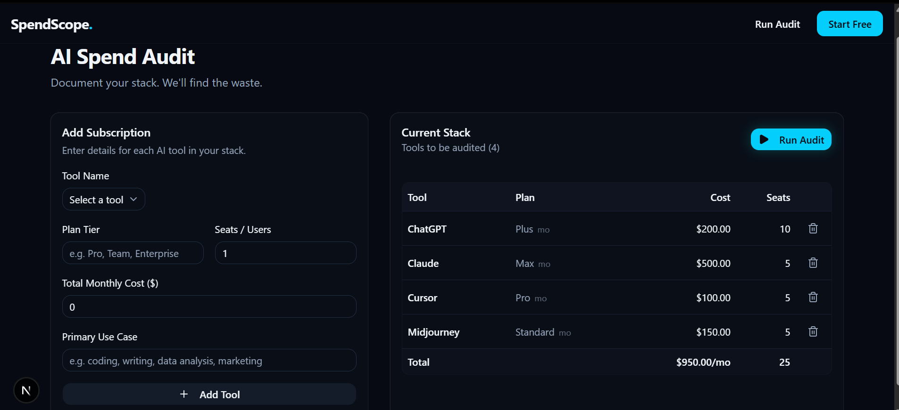
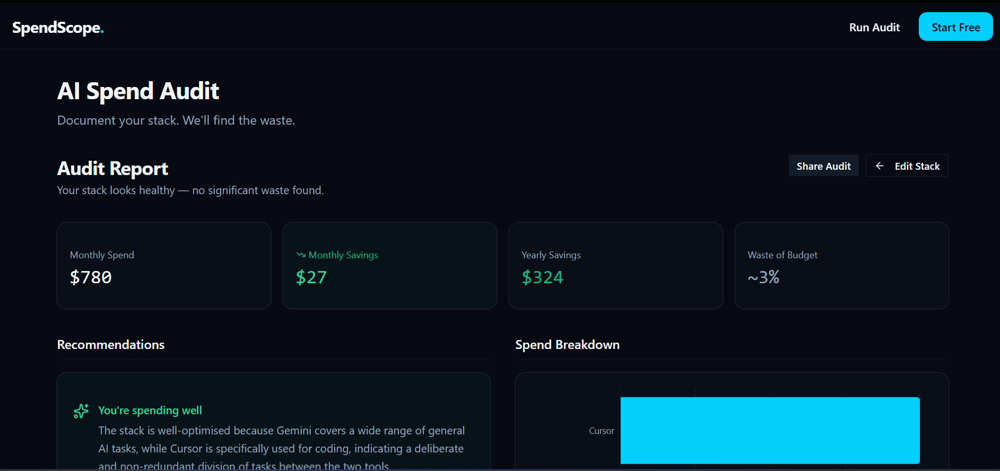
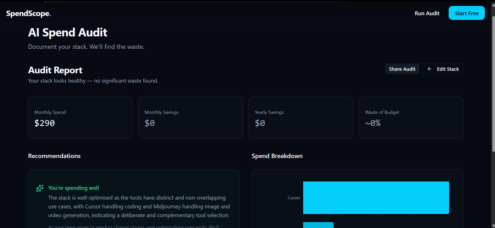

# SpendScope

SpendScope is an AI spend audit platform built for startups and engineering teams to analyze, optimize, and reduce spending on AI tools like ChatGPT, Claude, Cursor, GitHub Copilot, Gemini, Midjourney, Jasper, Grammarly, Notion AI, and API-based LLM services.

The platform audits a company’s AI tooling stack, identifies overlapping subscriptions and inefficient plans, estimates potential monthly/yearly savings, and generates actionable recommendations through a fast, shareable, founder-friendly interface.

Built as part of the Credex Web Development Intern Assignment. :contentReference[oaicite:0]{index=0}

---

# Live Demo

Production URL:

```txt
https://spendscope-alpha.vercel.app
```

---

# Screenshots

## Landing Page


## Audit Form


## Audit Results Dashboard


## Shared Public Audit URL


---

# Features

## AI Spend Audit Engine

- 17-rule deterministic audit engine
- Cross-tool redundancy detection
- Plan downgrade recommendations
- Billing optimisation checks
- Enterprise overspend detection
- Consolidation recommendations
- Savings estimation logic

---

## Semantic Use-Case Analysis

SpendScope uses Groq (`llama-3.3-70b-versatile`) to semantically interpret user-entered use cases.

Instead of simple keyword matching, the system understands natural-language descriptions such as:
- “everything except image generation”
- “mostly coding with some docs”
- “research-heavy workflow”

This reduces false positives and improves recommendation quality.

---

## AI Recommendation Enrichment

Groq is used to:
- rewrite recommendations in CFO-style language
- generate founder-readable audit summaries
- improve recommendation specificity

The actual audit logic remains deterministic and rule-based.

---

## Results Dashboard

- Total monthly savings
- Total yearly savings
- Per-tool breakdown
- Severity badges
- Recommendation filtering
- Expandable recommendation cards
- Spend breakdown visualization
- “You’re spending well” state for already-optimised stacks

---

## Credex Lead Generation Flow

For audits showing significant savings opportunities:
- Credex consultation CTA is surfaced prominently

For already-efficient stacks:
- users can subscribe for future optimisation alerts instead

---

## Persistence + Sharing

- localStorage persistence
- public shareable audit URLs
- Open Graph compatible audit pages
- company-identifying information stripped from public pages

---

## Backend + Infrastructure

- Supabase database storage
- Resend transactional email integration
- Honeypot abuse protection
- GitHub Actions CI pipeline
- Production deployment on Vercel

---

# Tech Stack

- Next.js App Router
- TypeScript
- TailwindCSS
- shadcn/ui
- Supabase
- Resend
- Groq API
- Vercel
- Vitest
- GitHub Actions

---

# Architecture Overview

```txt
Landing Page
    ↓
Audit Form
    ↓
Semantic Stack Analysis (Groq)
    ↓
Deterministic Audit Engine
    ↓
Recommendation Enrichment (Groq)
    ↓
Results Dashboard
    ↓
Lead Capture + Shareable Report
```

---

# Audit Pipeline

```txt
User Inputs
    ↓
Tool Metadata
    ↓
Semantic Capability Analysis
    ↓
Audit Rules Engine
    ↓
Savings Calculations
    ↓
Recommendation Filtering
    ↓
AI Recommendation Enrichment
    ↓
Results Rendering
```

---

# Running Locally

## 1. Clone the repository

```bash
git clone <repo-url>
cd spendscope
```

---

## 2. Install dependencies

```bash
npm install
```

---

## 3. Configure environment variables

Create:

```txt
.env.local
```

Add:

```env
GROQ_API_KEY=your_key
NEXT_PUBLIC_SUPABASE_URL=your_url
NEXT_PUBLIC_SUPABASE_ANON_KEY=your_key
RESEND_API_KEY=your_key
```

---

## 4. Start development server

```bash
npm run dev
```

---

## 5. Run tests

```bash
npm test
```

---

## 6. Run lint

```bash
npm run lint
```

---

## 7. Production build

```bash
npm run build
```

---

# Testing

Vitest-based automated tests cover:
- savings calculations
- plan downgrade logic
- overlap detection
- enterprise threshold logic
- optimisation-state behaviour
- recommendation filtering

Current status:
- 10 tests
- 10 passing

See:
```txt
TESTS.md
```

---

# CI/CD

GitHub Actions workflow:
- runs lint
- runs tests
- validates pushes to `main`

Workflow file:

```txt
.github/workflows/ci.yml
```

---

# Key Product Decisions

## 1. Deterministic audit logic over fully AI-generated audits

Financial recommendations should remain explainable and stable.

AI is used only for:
- interpretation
- summarisation
- communication

---

## 2. Semantic analysis instead of keyword matching

Natural-language use cases are messy.

Semantic interpretation reduced brittle recommendation logic and false positives.

---

## 3. No login wall before value delivery

Users receive the audit before email capture.

This improves:
- trust
- conversion probability
- shareability

---

## 4. Conservative recommendation strategy

SpendScope avoids manufacturing savings.

If a stack is already well-optimised, the platform explicitly says so.

---

## 5. Founder/CFO-style tone over “AI startup hype”

The product intentionally avoids:
- exaggerated claims
- flashy AI language
- aggressive upselling

The goal was to make recommendations feel operational and trustworthy.

---

# Lighthouse Scores

Incognito production scores:

- Performance: 98
- Accessibility: 100
- Best Practices: 100
- SEO: 100

---

# Repository Structure

```txt
src/
├── app/
├── components/
├── lib/
├── tests/
├── types/
└── styles/
```

---

# Additional Documentation

- `ARCHITECTURE.md`
- `DEVLOG.md`
- `REFLECTION.md`
- `TESTS.md`
- `PRICING_DATA.md`
- `PROMPTS.md`
- `GTM.md`
- `ECONOMICS.md`
- `USER_INTERVIEWS.md`
- `LANDING_COPY.md`
- `METRICS.md`

---

# Assignment Context

This project was built for the Credex Web Development Intern Assignment.

The assignment emphasized:
- shipping a real product
- entrepreneurial thinking
- engineering discipline
- product reasoning
- documentation quality
- deployment readiness

Assignment brief: :contentReference[oaicite:1]{index=1}